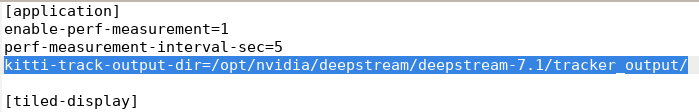

# PipeTuner Documentation

URL: https://docs.nvidia.com/metropolis/deepstream/dev-guide/text/Pipetuner-guide.html


## ℹ️ Introduction

- **Overview:** PipeTuner is a tool that automatically tests different settings to find the best configuration for your pipeline. It helps you get the best performance on your dataset without needing to understand all the technical details of how the pipeline works.
- **Configuration:** Uses YAML-based configuration files to define tuning parameters, constraints for optimization as well as paths leading to the necessary model files and etc.

Note that PipeTuner still only has one version which is 1.0.

## 🛠️ What PipeTuner 1.0 makes use of:

| **Version/Details** | **Purpose** |
| --- | --- |
| Ubuntu 22.04 | Base OS environment |
| DeepStream 7.0 Docker Container | Primary inference and pipeline execution |
| PipeTuner 1.0 Docker Container | Automated pipeline configuration tuning |
| TensorRT 8.6.1.6 | Engine creation and initialization in the DeepStream 7.0 Container |
| CUDA 12.2 | GPU acceleration and compute in DeepStream 7.0 Container |
| MOTA format Data | Ground truth in MOTA data format |

Before continuing, install pipetuner first.

## 📥 Step-by-Step Instructions:

### Prepare working environment

Update the package installer

```bash
sudo apt update
```

Install gedit which is a notepad like environment for Linux Ubuntu if haven’t

```bash
sudo apt install gedit -y
```

Move to the working Dir

```bash
cd /'your_path'/pipe-tuner-sample/scripts
```

Replace ‘your_path’ with the path to your pipe-tuner-sample folder

 

### Prepare necessary config files

Copy the contents of the 'pipetuner_config.yml' and paste it inside

```bash
sudo gedit /'your_path'/pipe-tuner-sample/configs/config_PipeTuner/pipetuner_config.yml
```

Instructions:

- Make sure to change only the ‘streamRes’, ‘pgiePath’ and ’trackerPath’ accordingly which acts as the paths to mount to Pipetuner Docker container.

       eg: config/config_PGIE/’your_pgie_file’.txt

Copy the contents of the ‘config_infer_primary_custom.txt’ and paste it inside

```bash
sudo gedit /'your_path'/pipe-tuner-sample/configs/config_PipeTuner/config_infer_primary_custom.txt
```

Instructions:

- Make sure that the ‘onnx-model-file’, ’labelfile_path’, ‘model-engine-file’ and ‘custom-lib-path’ points correctly to the  path specified in the file which acts as the paths to mount to Pipetuner Docker container.

        eg: move your onnx model to /’your_path’/pipe-tuner-sample/models/best_b4.onnx

### Custom Data preparation

The best and fastest way to prepare your custom data is to enable KITTI tracker output when running your DeepStream app.

```bash
sudo gedit /opt/nvidia/deepstream/deepstream-7.1/pipeline.txt
```

Instructions:

- Set `kitti-track-output-dir=/opt/nvidia/deepstream/deepstream-7.1/tracker_output/` in `[application]` group



Now run the DeepStream app to retrieve your tracker output in KITTI format

```bash
deepstream-app -c /opt/nvidia/deepstream/deepstream-7.1/pipeline.txt
```

You tracker_output folder will look like this 


In **‘00_001_000003.txt’**,  the  **‘001’** represents the source number of the stream and the **‘000003’** represents the frame number. 

Now use the **‘KITTI_TO_MOT.py’** file to convert the **KITTI** tracker output files to **one MOT gt.txt** format which pipetuner requires.

You can then use the following annotation tool under **‘Drive2/yilin/annotation-tool’** to correct the ground truths **gt.txt** which is now in MOT format for tunning.

In this case I have already prepared my own custom data **gt.txt** for PipeTuner in these 2 folders. 

**‘sample_videos’** and **‘sample_utils’.**

You should place your prepared ‘gt.txt’ in the same format as the above 2 folders.

Finally, copy the 2 folders to Pipetuner mount paths

```bash
sudo cp -r /'your_path'/sample_utils /'your_path'/pipe-tuner-sample/data
```

&&&

```bash
sudo cp -r /'your_path'/sample_videos /'your_path'/pipe-tuner-sample/data
```

Make sure to replace ‘your_path’ and custom data accordingly

Make sure your ‘pipetuner_config.yml’ uses your custom data 

```bash
sudo gedit /'your_path'/pipe-tuner-sample/configs/config_PipeTuner/pipetuner_config.yml
```

Instructions:

- Make sure to change only the ‘datasetPath’ and ’seqmapPath’ accordingly which acts as the paths to mount to Pipetuner Docker container.

       egs: **seqmapPath**: "data/sample_utils/sample_all.txt” 

        **datasetPath: "data/sample_videos”**

### **Custom Resolution support**

To enable custom resolution support (eg: 1280 by 720) to match your custom data, you have to modify their source code in the Pipetuner 1.0 Docker container. (this solution can be found in the forum here ([https://forums.developer.nvidia.com/t/pipetuner-custom-resolution-support/293909/3](https://forums.developer.nvidia.com/t/pipetuner-custom-resolution-support/293909/3))

Launch the pipetuner 1.0 Docker container from the image

```bash
docker run --gpus all -it --net=hos/pipe-tuner/configs/config_dsApp/sourcen_dec_infer_tracker.txtt --privileged -v /tmp/.X11-unix:/tmp/.X11-unix -e DISPLAY=$DISPLAY nvcr.io/nvidia/pipetuner:1.0
```

Once inside the container, update your package and install nano

```bash
apt update && sudo apt install -y nano
```

Edit their ‘sourcen_dec_infer_tracker.txt’

```bash
nano /pipe-tuner/configs/config_dsApp/sourcen_dec_infer_tracker.txt
```

Instructions:

- In the `[streammux]` group, set`width`and `height` accordingly to the resolution your custom data use. If not, default resolution is 1920 by 1080 as their sample data is in 1080p.
- Also set `live-source=0` in the `[streamux]` group.

Now launch a new Ubuntu terminal to commit and save the docker container. 

In the new Ubuntu terminal, find the following Pipetuner 1.0 container ID using

```bash
docker ps 
```

Save the running Pipetuner 1.0 container

```bash
docker commit [container id]
```

Replace the container ID with the following ID you found from the previous command

Now copy the committed image ID from the previous command and save it as ‘nvcr.io/nvidia/pipetuner:1.0_modified’ image.

```bash
docker tag [committed image id] nvcr.io/nvidia/pipetuner:1.0_modified
```

You should now be able to see the following saved image when running

```bash
docker images
```


Once verified, you may exit the Pipetuner 1.0 docker container in the old ubuntu terminal session by running

```bash
exit
```

Now edit [launch.sh](http://launch.sh) to use the newly saved image

```bash
sudo gedit /'your_path'/pipe-tuner-sample/scripts/launch.sh
```

Instructions: 

- Set `tuner_image=`’[nvcr.io/nvidia/pipetuner:1.0_modified](http://nvcr.io/nvidia/pipetuner:1.0_modified)’.

Now you have custom resolution support.

### **Launch PipeTuner tuning process**

To run PipeTuner process, simply used the following command

```bash
bash launch.sh  nvcr.io/nvidia/deepstream:7.0-triton-multiarch  ../configs/config_PipeTuner/pipetuner_config.yml
```

Note that launching an instance of pipetuner would take awhile.

After waiting awhile, the console output would like the following

```bash
Installing dependencies...
Installing dependencies (1/2)
Installing dependencies (2/2)
Launch BBO client...
Launch BBO server...
PipeTuner started successfully!

!!!!! To stop tuning process in the middle, press CTRL+C !!!!!

adding: DsAppServer (deflated 63%)
2024-03-19 08:09:52,108 root           INFO    seq_list: ['Retail_Synthetic_Cam01', 'Retail_Synthetic_Cam02', 'Retail_Synthetic_Cam03', 'Retail_Synthetic_Cam04', 'Retail_Synthetic_Cam05', 'Retail_Synthetic_Cam06', 'Retail_Synthetic_Cam07', 'Retail_Synthetic_Cam08']
2024-03-19 08:09:52,169 root           INFO    Writing configs to <path>/output/SDG_sample_PeopleNet-ResNet34_NvDCF-ResNet50_MOT_test.yml_output/results/configs_03-19-2024_08-09-52
2024-03-19 08:09:52,169 root           INFO    send backend init
2024-03-19 08:09:52,170 root           INFO    creating optimizers...
2024-03-19 08:09:52,170 root           INFO    done. created 2
 * Serving Flask app 'ds_bbo_frontend_server'
 * Debug mode: on
2024-03-19 08:09:52,186 root           INFO    init jobs done
```

If you then see the following error:

```bash
[server core] initializing
2025-09-25 02:54:46,487 root         INFO     wait backend ready
2025-09-25 02:54:48,788 root         WARNING  DsApp score is 0. number of 0 scores:1
2025-09-25 02:54:48,800 root         WARNING  DsApp score is 0. number of 0 scores:2
2025-09-25 02:54:50,612 root         WARNING  DsApp score is 0. number of 0 scores:3
2025-09-25 02:54:50,613 root         WARNING  DsApp score is 0. number of 0 scores:4
2025-09-25 02:54:52,739 root         WARNING  DsApp score is 0. number of 0 scores:5
2025-09-25 02:54:52,739 root         WARNING  DsApp score is 0. number of 0 scores:6
2025-09-25 02:54:54,570 root         WARNING  DsApp score is 0. number of 0 scores:7
2025-09-25 02:54:54,571 root         WARNING  DsApp score is 0. number of 0 scores:8
2025-09-25 02:54:55,479 root         INFO     progress: 40% (8/20) ETA 00:00:15
2025-09-25 02:54:56,682 root         WARNING  DsApp score is 0. number of 0 scores:9
2025-09-25 02:54:56,682 root         WARNING  DsApp score is 0. number of 0 scores:10
2025-09-25 02:54:58,812 root         WARNING  DsApp score is 0. number of 0 scores:11
2025-09-25 02:54:58,824 root         WARNING  DsApp score is 0. number of 0 scores:12
2025-09-25 02:54:59,140 root         ERROR    Too many 0 scores from DS app. We stop all processes. Please check DS app logs
2025-09-25 02:54:59,140 root         ERROR    OPTIMIZATION not completed!
[result sender] up and running!
[worker 0] up and running!
[worker 1] up and running!
received /reset call
[server core] resetting
stopping result senders...
done.
stopping workers...
number of workers to stop: 2
number of workers to stop: 0
done.
 
!!!!! Press CTRL+C key to end PipeTuner !!!!!
```

It is to be expected as Pipetuner only supports their sample model that they provided you when you installed pipetuner.  

The moment you swapped PGIE detector file paths in your pipetuner_config.yml to use their sample detector, the tuning process should work as expected.

## 🔧 Fixes I have tried for custom model to work:

- Tried compiling parser.cpp inside the DeepStream 7.0 docker container to a library .so file and the using it
- Tried building the engine manually inside the DeepStream 7.0 docker container which uses TensorRT 8.6.1.6 to build the engine then using it
- Tried another detector which is the RT-DETR detector instead of the custom batch_b4 detector.
- Verified all the config paths and proper YAML format and indentations in ‘pipetuner_config’.
- Verified that the **‘config_infer_primary_custom.txt’ for the batch_b4 model**  and **‘config_infer_rtdetr’ for rt-detr model** works correctly when running DeepStream app outside of PipeTuner.
- Verified that the my custom data works with their sample detector.
- Created my own [Forum post](https://forums.developer.nvidia.com/t/pipetuner-error-dsapp-score-is-0/346482) for help but solutions recommended did not work.
- Attempted to modify their source code but source code for PipeTuner is not publicly available on GitHub. And inside the container they made use of some Flask server so its very hard to investisgate their source code
- Tried alot of other simple fixes but to no avail

        

I suspect the **DsAppScore is 0 error** is due to failed initialisation of any custom detector models that you use as I suspect pipetuner only works for their sample detector. 


When ran with their provided sample detector, this is part of the output.


When ran with either the batch_b4 or rt-detr detector, this is the output.